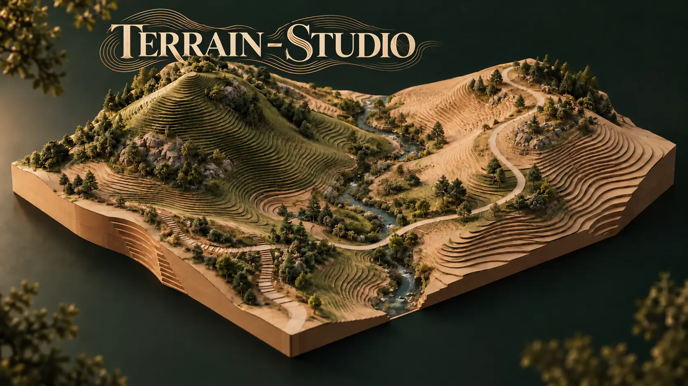
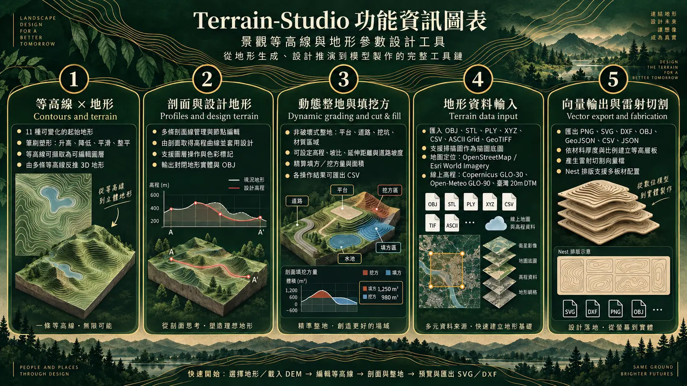

# Terrain-Studio



**Terrain-Studio** 是一套瀏覽器內運作的景觀等高線與地形參數設計工具。它讓設計者在「等高線、三維地形、剖面、整地與數位製造」之間快速往返，適合景觀及都市設計的設計推演、教學與模型製作前期。

> 景觀及都市設計 · 參數設計工具
> Created by Jerry Hsu

[開啟線上工具](https://landscape-contour-studio.jerry428tw.chatgpt.site)

## 核心流程

```text
地形預設 / DEM / 點雲 / 網格
            ↓
        三維地形與等高線
            ↓
剖面設計、動態整地、填挖方分析
            ↓
平面圖、OBJ、SVG、DXF、雷切排版
```

## 功能



### 等高線 × 地形

- 11 種可變化的起始地形，包含雙丘谷地、山脊、蜿蜒谷地、階地、火山口、海岸、沙丘與鞍部。
- 以筆刷升高、降低、平滑與整平地形；即時生成首曲線與每五條加粗的計曲線。
- 將等高線擷取為可編輯圖層，支援節點拖曳、整條移動、插入／刪除節點、顯示、鎖定、排序、複製及刪除。
- 由多條等高線反推高度場，並同步更新三維地形。

### 剖面與設計地形

- 可管理多條剖面線，支援節點與整條移動、圖層操作及色彩標記。
- 從剖面取得地形高程曲線，繪製設計剖面後套用至地形。
- 3D 視圖為有厚度、側牆與底面的封閉地形實體；OBJ 匯出為可用於後續製作的封閉網格。

### 動態整地與填挖方

- 非破壞式整地堆疊：平台、道路、挖坑與材質區域。
- 平台可設定目標高程、挖／填方開關、坡比與延伸距離；道路可設定寬度、固定或縱向坡度、地形跟隨與橫坡。
- 以三角網格的線性積分計算填方與挖方，避免正負高差在同一網格中互相抵銷。
- 各整地操作可個別檢視投影／表面面積與填挖方量，並匯出 CSV。

### 地形資料輸入

- 匯入 OBJ、STL、ASCII PLY、XYZ、CSV、ESRI ASCII Grid 與單波段 GeoTIFF。
- 支援掃描圖作為可縮放的描圖底圖。
- 地圖定位使用 OpenStreetMap 或 Esri World Imagery；地圖僅供定位與框選，並非高程來源。
- 線上高程預設使用 Copernicus GLO-30 DSM，失敗時可明確切換至 Open-Meteo GLO-90；亦可匯入臺灣官方 20 m DTM GeoTIFF。

### 向量輸出與雷射切割

- 匯出平面 PNG、等高線 SVG、OBJ、XYZ CSV、GeoJSON、填挖方 CSV 與專案 JSON。
- 依材料厚度、模型比例與切片間距建立等高層板。
- 產生 SVG 或 DXF 向量切割檔，可在 Illustrator、CAD 與雷射切割軟體中開啟。
- Nest 提供多板材的 0°／90° 層板排版、間距與邊界設定；目前採矩形 shelf packing，而非最佳化多邊形巢狀排版。

## 快速開始

1. 選擇起始地形，或從「資料輸入」載入 DEM、點雲或網格。
2. 在「平面與等高線」調整高程、描繪或編輯等高線。
3. 以剖面線與動態整地工具建立設計地形，檢視填挖方。
4. 前往「製作」設定比例與材料厚度，預覽、排版並匯出 SVG／DXF。

## 資料與精度說明

- 本工具的模型為 **2.5D 高度場**；無法表現洞穴、懸挑或一般實體布林運算。
- Copernicus GLO-30 為 DSM，可能保留植被或建物高度；需要裸地地形時，建議使用已處理的 DTM／DEM GeoTIFF。
- OSM、衛星影像與地圖底圖不能提高 DEM 精度，只用於確定範圍。
- 填挖方為設計推估值，不包含夯實、膨脹、表土剝除、邊坡穩定、擋土結構與現地測量誤差。
- 雷切輸出不含 kerf 補償；切割前請依機台、材料與比例試切確認。

## 本機使用與驗證

本專案為純靜態網頁，可由任何靜態伺服器提供 `dist/` 目錄。

```bash
node tests/audit.mjs
node tests/grading.mjs
node tests/geo.mjs
node tests/raster.mjs
```

測試涵蓋地形、等高線、填挖方、整地堆疊、座標／DEM 取樣與 GeoTIFF 讀取的解析驗證。

## 資料來源與致謝

- [Copernicus DEM](https://dataspace.copernicus.eu/)
- [Microsoft Planetary Computer](https://planetarycomputer.microsoft.com/)
- [Open-Meteo Elevation API](https://open-meteo.com/en/docs/elevation-api)
- [OpenStreetMap](https://www.openstreetmap.org/copyright)
- [Esri World Imagery](https://www.esri.com/en-us/legal/terms/full-master-agreement)
- [GeoTIFF.js](https://github.com/geotiffjs/geotiff.js)（MIT）與 [Leaflet](https://leafletjs.com/)（BSD-2-Clause）

---

Terrain-Studio is a browser-based landscape terrain, contour, grading, and fabrication study tool. It is intended for conceptual design and teaching; verify survey data, engineering design, and fabrication settings before construction or production.
